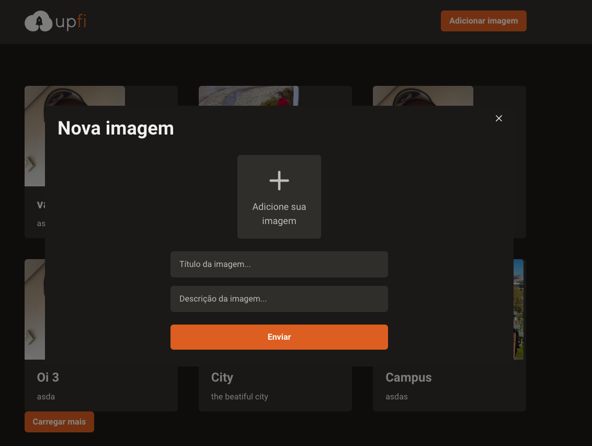

#Desafio Ignite Q3 2021



## Setup

git clone https://github.com/vagnerolliver/ignite-challenge-03-creating-hook-shopping-cart

Instal dependencies

```bash
$ yarn

or

$ npm install
```

## Run


```bash
$ yarn or npm dev
````

Browser

http://localhost:3001

## Tests
$ yarn or npm test
